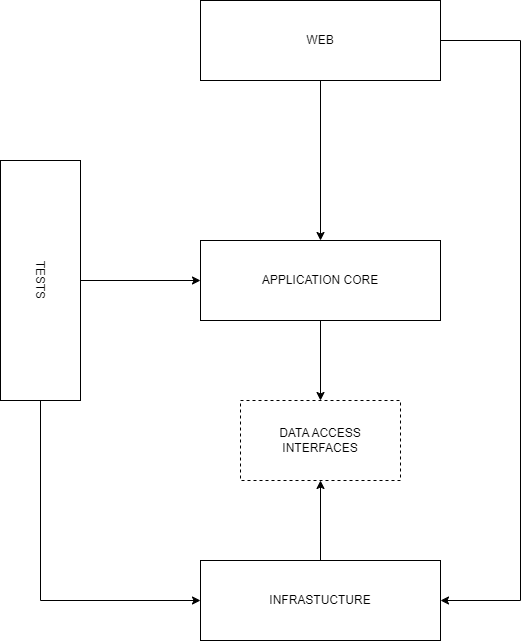
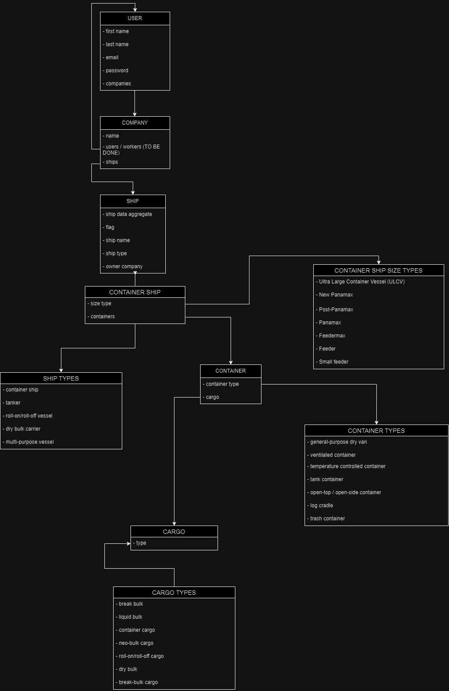

**Maritime Cargo Transportation**
===============================

** Project about maritime cargo transportation. Workers of ship owning companies can use this application to manage their cargo ships. At the moment only container ship are supported **

How to run
----------
Run application container
```bash
docker run --rm -p 8080:8080 --name maritime-container maritime-cargo-aspnet
```

Run PostgreSQL container
```bash
docker run --rm -p 5432:5432 --name maritime-db -e POSTGRES_PASSWORD=postgres -e POSTGRES_USER=postgres -e POSTGRES_DB=maritime postgres
```

Connect to PostgreSQL container
```bash
docker exec -it maritime-db psql sh -c "psql --host=localhost --user=postgres"
```


*layered architecture ↓*



*domain entities ↓*



*database entities ↓*


