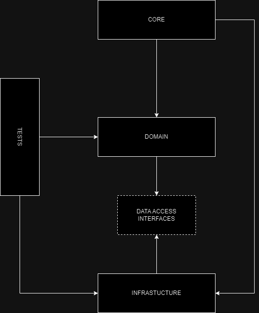

**Maritime Cargo Transportation**
===============================

** Project about maritime cargo transportation. Workers of ship owning companies can use this application to manage their cargo ships. At the moment only container ship are supported **

How to run
----------
```bash
docker run --rm -p 8080:8080 --name maritime-container maritime-cargo-aspnet
```


*layered architecture ↓*



*initial diagram of entities ↓*


