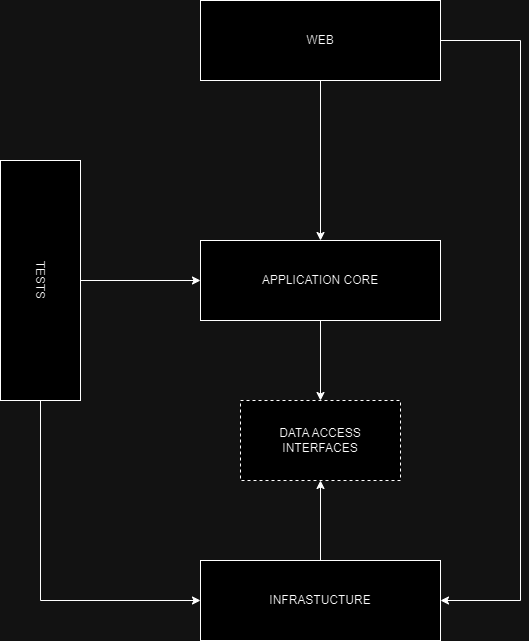

**Maritime Cargo Transportation**
===============================

** Project about maritime cargo transportation. Workers of ship owning companies can use this application to manage their cargo ships. At the moment only container ship are supported **

How to run locally with hot-reload
----------
Run application container
```bash
dotnet watch --project Web/Web.csproj
```

Run PostgreSQL container
```bash
docker run --rm -p 5432:5432 --name maritime-db -e POSTGRES_PASSWORD=root -e POSTGRES_USER=postgres -e POSTGRES_DB=maritime postgres
```

Connect to PostgreSQL container | need to create maritime_cargo_transportation_db and seed it with data.
```bash
docker exec -it maritime-db sh -c "psql --host=localhost --user=postgres"
```

There is an option to run application with docker compose
--------
Build containers
```bash
docker compose build
```

Run containers
```bash
docker compose up
```

*layered architecture ↓*



*domain entities ↓*


*database entities ↓*


